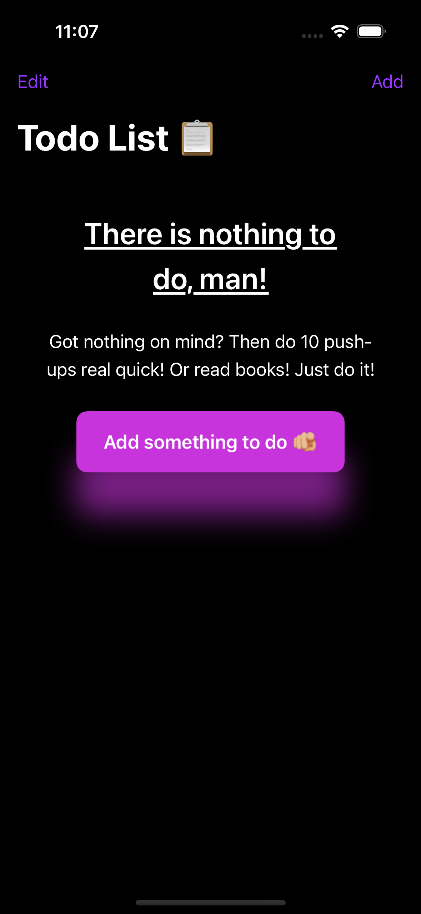
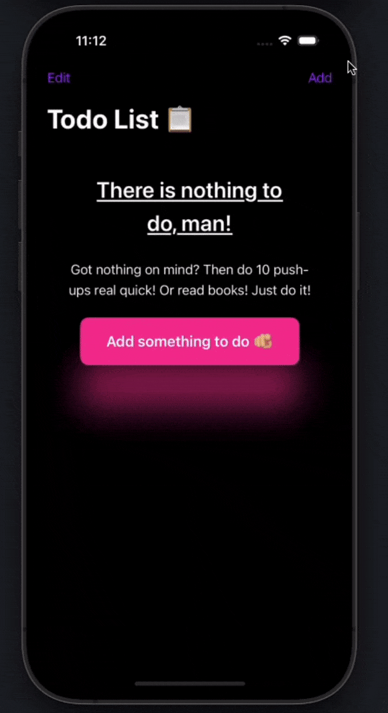

# TaskNest 📋
[](https://swift.org)
[](https://developer.apple.com/ios/)
[](https://developer.apple.com/xcode/swiftui/)

TaskNest is a clean and intuitive ToDo list application built with SwiftUI. It features a modern user interface, smooth animations, and persistent storage to help you stay organized and productive.

## Features 🚀

- ✅ Create, read, update, and delete tasks
- 🔄 Drag and drop to reorder tasks
- 💾 Persistent storage using UserDefaults
- 🎨 Clean and modern UI with animations
- ✨ Empty state handling with engaging messages
- 📱 Native iOS look and feel

## Screenshots 📸

<!-- Add your screenshots here -->




## Demo 🎥

<!-- Add your GIF demo here -->


## Requirements 📋

- iOS 15.0+
- Xcode 13.0+
- Swift 5.5+

## Installation 💻

1. Clone the repository:
```bash
git clone https://github.com/yourusername/TaskNest.git
```

2. Open `TaskNest.xcodeproj` in Xcode

3. Build and run the project (⌘+R)

## Architecture 🏗

TaskNest follows the MVVM (Model-View-ViewModel) architecture pattern:

- **Models**: `ItemModel`
- **Views**: 
  - `ListView` (Main view)
  - `AddView` (Task creation)
  - `ListRowView` (Individual task row)
  - `NoItemsView` (Empty state)
- **ViewModels**: `ListViewModel`

## Key Features Explained 🔍

### Persistent Storage
Tasks are automatically saved to UserDefaults when modified:
```swift
func saveItems() {
    if let encodedData = try? JSONEncoder().encode(items) {
        UserDefaults.standard.set(encodedData, forKey: itemKey)
    }
}
```

### Task Management
Tasks can be:
- Added with validation (minimum 3 characters)
- Marked as complete/incomplete
- Deleted
- Reordered

### Animations
The app features smooth animations for:
- Empty state transitions
- Task completion
- Button interactions

## Contributing 🤝

1. Fork the repository
2. Create your feature branch (`git checkout -b feature/AmazingFeature`)
3. Commit your changes (`git commit -m 'Add some AmazingFeature'`)
4. Push to the branch (`git push origin feature/AmazingFeature`)
5. Open a Pull Request

Acknowledgments 👏

Nick Sarno - https://github.com/SwiftfulThinking

## Contact 📫

Sabbir Nasir - nsabbir26@gmail.com

Project Link: [https://github.com/sabbirn26/TaskNest](https://github.com/sabbirn26/TaskNest)
